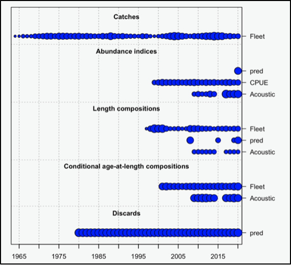

# Predator Vignette {#predator}

```{r, echo = FALSE}
xfun::embed_dir('data/Simple', text = 'Download the predator vignette files here.')
```

## Introduction

The goal here is to model the overall natural mortality (M) to include explicit mortality caused by predators. Please see the [Predator Fleet Mortality](https://nmfs-stock-synthesis.github.io/doc/SS330_User_Manual_release.html#predator-fleet-mortality) section in the SS3 User Manual for more details.

With this approach, $M = M1 + sum(M2)$. The M1 is the base and is modeled with the existing M options to allow for various approaches to age-specific M.

## Predator Setup

### Basic Predator Setup

There can be multiple predators, each adding a M2. These are contained in the same arrays as fishing fleets (see line X of the data file, section 7.6.0.1 Fleet type in [Fleet Definitions](https://nmfs-stock-synthesis.github.io/doc/SS330_User_Manual.html#fleet-definitions), and [Predator Fleets](https://nmfs-stock-synthesis.github.io/doc/SS330_User_Manual.html#predator-fleets)), so M2 has available all the code characteristics as a fishing fleet. **Very little code is specific to predators.**

### Further Predator Setup

Each predator will have selectivity (age and/or length) just as any other fleet.

Each predator will kill fish. $M2(f)/Z$ is the fraction of the total kill that is consumed by the predator (f).

Retained catch is not entered for predator fleets, nor is there a need to enter placeholder values.

Consumption by predators is stored in the discard arrays. Therefore data on the amount of consumption can be entered as discard data, where SS3 will include it in the estimation of M2 values.

The abundance of the predator is the "fishing effort" that drives the level of M2. If predator abundance is available, it can be entered as a survey of "F". The format for this looks like:

```         
#_Units: 0=numbers; 1=biomass; 2=F; 30=spawnbio; ……
#_Errtype: -1=normal; 0=lognormal; >0=T
#_SD_Report: 0=no sdreport; 1=enable sdreport
#_Fleet Units Errtype SD_Report
1 1 0 0 # fishing_fleet
2 2 0 0 # pred
```

This will trigger the need to specify a catchability for this fleet in the control file. *\*Note: At this time, specific catchability (e.g. consumption/predator) options are not available for predators, but they could be developed in the future.*

Neither consumption data or predator abundance data is necessary, but they are both helpful in tuning the level and time-variation of M2.

If diet data with size or age composition of the prey is available, it can be entered in the composition data section (link to the [Length Composition Data](https://nmfs-stock-synthesis.github.io/doc/SS330_User_Manual.html#length-composition-data) and [Age Composition](https://nmfs-stock-synthesis.github.io/doc/SS330_User_Manual.html#age-composition-option) sections of the SS3 User Manual) where it will inform the estimation of the age/length selectivity of the predator for this prey.

Input of consumption amount in biomass or numbers

Input predator abundance as a "survey" of effort

Functional form to relate "F" by the predator to the predator abundance composition data is from gut contents, so there can be multiple predators (needs testing).

M2 has a random deviation over time to allow time-varying flexibility. Then we add data to inform those deviations. In this example, those data are consumption entered as discard data (link to the [Discard](https://nmfs-stock-synthesis.github.io/doc/SS330_User_Manual.html#discard) section of the SS3 User Manual). An alternative is to enter an indicator (e.g. survey) of the level of M2 itself (link to the [Indices](https://nmfs-stock-synthesis.github.io/doc/SS330_User_Manual.html#indices) section of the SS3 User Manual). This is not done here but would be a survey of type 2.

### Example

The example has: 4 seasons and M2 can vary by season.

#### Data file: 

-   One fleet is type 4 labeled as *Pred* [Line X].

    -   *The fact that at least one fleet is a predator triggers the need to include M2 internal to the SS3 calculations.*

-   The section of discard data is used as a place to enter the amount of consumption [Line X].

    -   *This is not absolutely necessary, but it does help calibrate the M2 levels.*

#### Control file:

This example has a somewhat complex M1 pattern by age. This is independent of M2 so need not be maintained in your work.

Setup M2 parameter [begins at line 106]:  

-   The M2 parameter has both a block to shift its value in 1964, and annual deviations [lines X].

-   The M2 parameter is set up to have annual deviations in the seasonal values of M2 [lines X].

    -   There are a lot of parameters. In this case it works because there is a discard observation for each one. It should still work without all that consumption data because it is a random effect, but let's talk if you have challenges.

Setup the size & age selectivity of the predator for the prey:

```         
#_Pattern Discard Male Special
24 0 0 0 # 1 Fleet
24 3 0 0 # 2 Pred
```

-   Notice that the discard flag is "3". This means that for the predator fleet the data file contains no relevant "retained catch", so the M2 level will only be informing the amount of "discard" which is the predator consumption.

-   In this example, the selectivity of the predator was set up using double normal (type=24), but parameters were set to essentially be logistic. You can change this as needed.

-   If you search through the report.sso file for "M2" you will find the parameter values near the top, the consumption output in the Discard section, and then will find the time series of M2 further down.

**Important Note:**

The discard label will appear in the plot below because predator consumption is stored internally in the same place as discards. See fig. \ref(fig:pred-fig)

````         
```{r pred-fig, fig.cap="fig caption"}

```
````

You can label chapter and section titles using `{#label}` after them, e.g., we can reference Chapter \@ref(intro). If you do not manually label them, there will be automatic labels anyway, e.g., Chapter \@ref(methods).

Figures and tables with captions will be placed in `figure` and `table` environments, respectively.

```{r nice-fig, fig.cap='Here is a nice figure!', out.width='80%', fig.asp=.75, fig.align='center'}
par(mar = c(4, 4, .1, .1))
plot(pressure, type = 'b', pch = 19)
```

Reference a figure by its code chunk label with the `fig:` prefix, e.g., see Figure \@ref(fig:nice-fig). Similarly, you can reference tables generated from `knitr::kable()`, e.g., see Table \@ref(tab:nice-tab).

```{r nice-tab, tidy=FALSE}
knitr::kable(
  head(iris, 20), caption = 'Here is a nice table!',
  booktabs = TRUE
)
```

You can write citations, too. For example, we are using the **bookdown** package [@R-bookdown] in this sample book, which was built on top of R Markdown and **knitr** [@xie2015].
